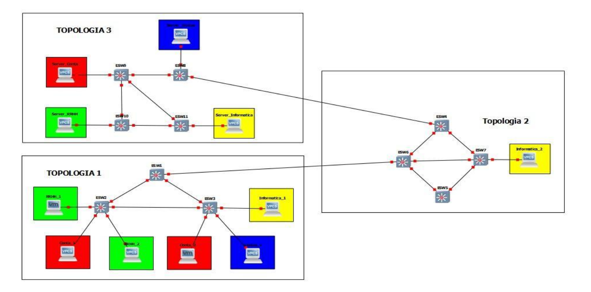

# **DOCUMENTACION PROYECTO 1 📑**

## Introduccion

Para la realización del _Proyecto No. 1_ del `Laboratorio de Redes de Computadoras 1` se realizó un cableado estructurado para una empresa de venta siguiendo la infraestructura proporcionada, y configurada debidamente para que proveer la comunicación necesaria.
La compañía cuenta con 4 departamentos: recursos humanos, informática, contabilidad y ventas. Cada usuario puede comunicarse con los demás usuarios de su mismo departamento y también con su servidor web si es que el departamento posee uno.

## Topología completa 🚀

<ul>
  <li>Topologias:
    <ul>
       <li><a href="https://github.com/DiiAns23/Practica1_Redes1/tree/main/Proyecto1/Topolog%C3%ADa%201:%20%C3%81rea%20de%20Trabajo" target="_blank">:point_right:Topologia 1</a></li>
       <li><a href="https://github.com/DiiAns23/Practica1_Redes1/tree/main/Proyecto1/Topolog%C3%ADa%202:%20Backbone" target="_blank">:point_right:Topologia 2</a></li>
       <li><a href="https://github.com/DiiAns23/Practica1_Redes1/tree/main/Proyecto1/Topolog%C3%ADa%203:%20Zona%20de%20Servidores">:point_right:Topologia 3</a></li>
    </ul>
  </li>
</ul>