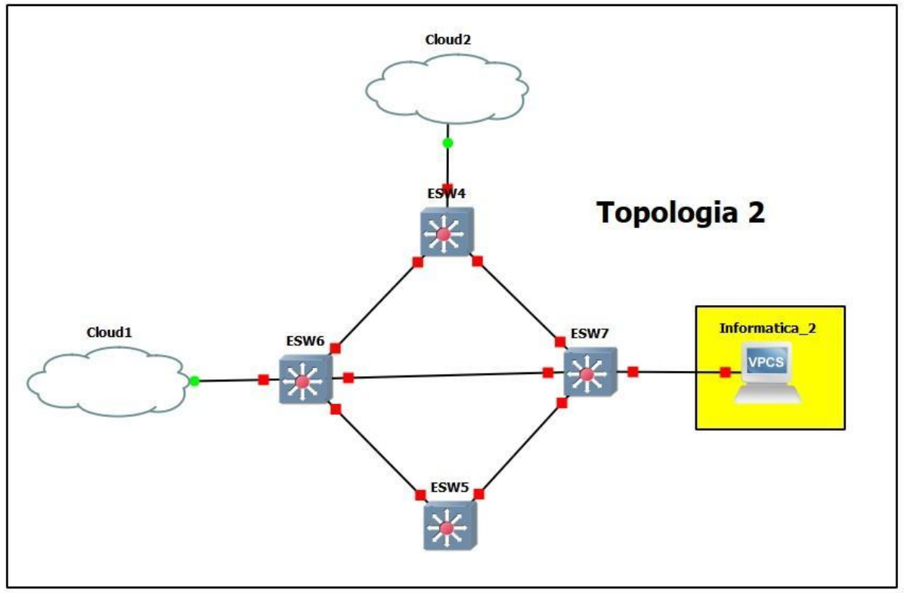

# comandos de como configurar el 
# primero se crean las vlan , correspondientes del proyecto
# creacion de las vlan
conf t
vlan 10
name RRHH
vlan 20
name Informatica
vlan 30
name Contabilidad
vlan 40
name Ventas
# vtp  del server
conf t
vtp domain GRUPO4
vtp password grupo4
vtp mode server
vtp version 2
exit
sh vtp status
# creacion del spanning-tree correspondiente a cada vlan
spanning-tree vlan 10 root primary
spanning-tree vlan 20 root primary
spanning-tree vlan 30 root primary
spanning-tree vlan 40 root primary

# vtp client

conf t
vtp domain GRUPO4
vtp password grupo4
vtp mode client
vtp version 2
exit

# comando para verificar, la configuracion del vtp

sh vtp status
 # configuacion de los puertos 

# puertos en modo truncal
conf t

int f1/0
switchport mode trunk
switchport trunk allowed vlan 1,10,20,30,40,1002-1005

int f1/1
switchport mode trunk
switchport trunk allowed vlan 1,10,20,30,40,1002-1005

int f1/2
switchport mode trunk
switchport trunk allowed vlan 1,10,20,30,40,1002-1005

int f1/3
switchport mode trunk
switchport trunk allowed vlan 1,10,20,30,40,1002-1005

# verificacion del spanning_tree
sh spanning-tree root
show spanning-tree brief
show spanning-tree blockedports

conf t

# puertos en modo acceso
int f1/2
switchport mode access
switchport access  vlan 20
