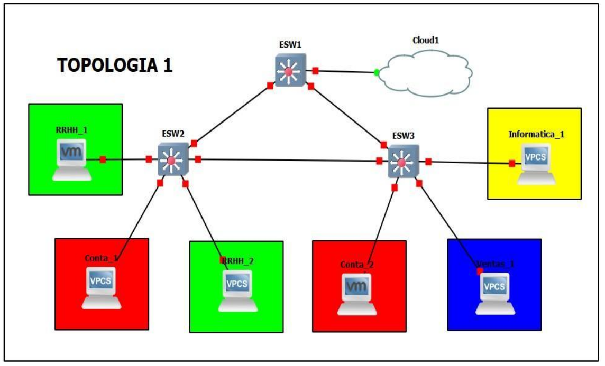

# **Detalle de comandos 📑**
--ESW1

conf t
vtp domain GRUPO4
vtp password grupo4
vtp version 2
vtp mode client

int f1/1
switchport mode trunk
switchport trunk allowed vlan 1,10,20,30,40,1002-1005
exit

int f1/2
switchport mode trunk
switchport trunk allowed vlan 1,10,20,30,40,1002-1005
exit

int f1/3
switchport mode trunk
switchport trunk allowed vlan 1,10,20,30,40,1002-1005
exit

--ESW2

conf t
vtp domain GRUPO4
vtp password grupo4
vtp version 2
vtp mode client

int f1/1
switchport mode trunk
switchport trunk allowed vlan 1,10,20,30,40,1002-1005
exit

int f1/2
switchport mode trunk
switchport trunk allowed vlan 1,10,20,30,40,1002-1005
exit

int f1/3
switchport mode access
switchport access  vlan 10
exit

int f1/4
switchport mode access
switchport access  vlan 30
exit

int f1/5
switchport mode access
switchport access  vlan 10
exit

--ESW3

conf t
vtp domain GRUPO4
vtp password grupo4
vtp version 2
vtp mode client

int f1/1
switchport mode trunk
switchport trunk allowed vlan 1,10,20,30,40,1002-1005
exit

int f1/3
switchport mode trunk
switchport trunk allowed vlan 1,10,20,30,40,1002-1005
exit

int f1/5
switchport mode access
switchport access  vlan 20
exit

int f1/4
switchport mode access
switchport access  vlan 40
exit

int f1/2
switchport mode access
switchport access  vlan 30
exit

--RRHH1_1
ip 192.168.41.10 255.255.255.0 192.168.41.1

--RRHH1_2
ip 192.168.41.20 255.255.255.0 192.168.41.1

--Conta_1
ip 192.168.43.10 255.255.255.0 192.168.43.1

--Conta_2
ip 192.168.43.20 255.255.255.0 192.168.43.1

--Ventas_1
ip 192.168.44.10 255.255.255.0 192.168.44.1

--Informatica_1
ip 192.168.42.10 255.255.255.0 192.168.42.1