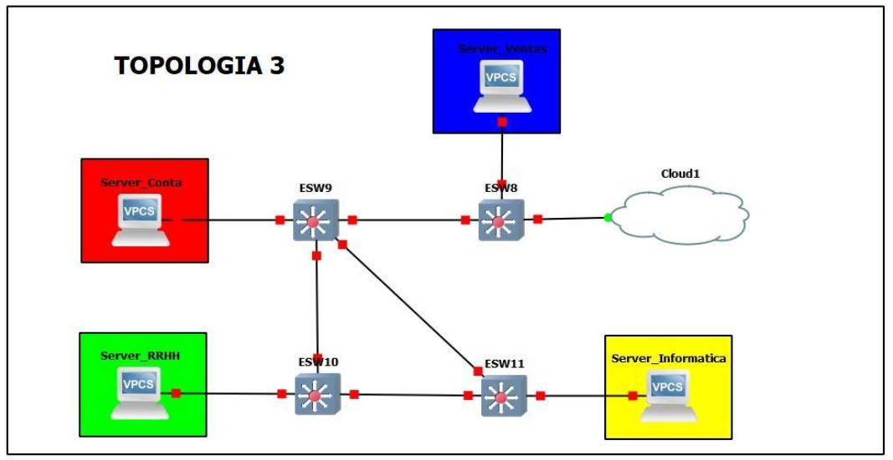

*TRANSPARENT*
conf t
vtp domain GRUPO4
vtp password grupo4
vtp version 2
vtp mode transparent
vlan 20
name Informatica
exit
sh vtp status
conf t
int f1/0
switchport mode access
switchport access vlan 20
exit
int f1/1
switchport mode trunk
switchport trunk allowed vlan 1,10,20,30,40,1002-1005
exit
int f1/3
switchport mode trunk
switchport trunk allowed vlan 1,10,20,30,40,1002-1005
exit

*CLIENTES*
conf t
vtp domain GRUPO4
vtp password grupo4
vtp version 2
vtp mode client
exit
sh vtp status
int f1/1
switchport mode trunk
switchport trunk allowed vlan 1,10,20,30,40,1002-1005
exit
int f1/2
switchport mode trunk
switchport trunk allowed vlan 1,10,20,30,40,1002-1005
exit
int f1/3
switchport mode trunk
switchport trunk allowed vlan 1,10,20,30,40,1002-1005
exit
exit